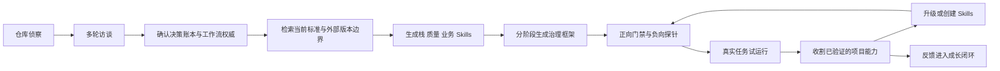

# AI Code Governance

面向新建与遗留项目的跨技术栈、跨平台 AI 代码治理 CLI 与 Agent Skill。

AI Code Governance inspects a real repository, researches current stack standards, generates project-specific coding and business skills, and continuously upgrades those skills when verified reusable capabilities are implemented.

## 为什么需要它

AI 编码治理经常退化成一组很快过时的 Markdown：多个客户端各维护一份规则、文档与代码逐渐脱节、助手自己宣布“完成”，但没有任何检查可以证明结果。

本 Skill 把治理实现为三个相互约束的部分：

1. **唯一正典源**：规则只维护一次，Claude Code、Codex、Cursor 等客户端通过适配器读取。
2. **最小上下文路由**：根据任务类型加载必要规则，而不是把整个知识库塞进每次对话。
3. **机器门禁**：检查引用、适配器、知识漂移和完成证据；能机器判断的规则不只写成散文。

它来自真实多仓项目的治理实践，但不携带一份冻结的“万能最佳实践”。框架惯用法来自目标版本的官方文档、正式标准和权威安全基线；业务写法来自目标项目的需求、代码、测试、事故、ADR 和用户决策。两类证据分别记录，再转换为项目可直接加载的细粒度 Skill。

## 核心能力

| 能力 | 说明 |
| --- | --- |
| `aicg` CLI | 通过 `init/check/sync/doctor` 初始化、校验和维护项目治理，不使用文件系统链接 |
| 仓库侦察 | 识别单仓、monorepo、仓库族、语言、框架、命令、文档、历史约束和现有 AI 配置 |
| 多轮访谈 | 区分仓库事实与用户决策，通过决策账本支持跨会话恢复 |
| 分层治理 | 提供 12 条核心原则和 L0–L11 十二层参考架构 |
| 技术栈能力包 | 识别前后端与平台组合，同时明确 `supported`、`unverified` 等证据等级 |
| 外部工作流编排 | 发现并有选择地整合 OpenSpec、Superpowers 等规格/执行 provider，以单一权威矩阵防止重复 design、plan 与 completion state |
| 标准 Skill 工厂 | 用可审计的一手来源快照按已安装或用户确认的精确技术生成组件、接口、授权、数据访问、事务、事件等细粒度编码 Skill，并标记刷新边界 |
| 业务写法 Skill | 从 actor、owner、状态机、租户权限、事务和外部副作用生成使用项目术语的标准实现流程 |
| 持续能力提取 | 权限、统一 Client、adapter 或业务流程完成后自动 harvest，优先升级已有 Skill，并阻止后续绕过正典封装 |
| UI 框架提案 | 基于产品、品牌、无障碍、SSR、许可证和团队约束提出三个候选及无框架方案 |
| 新旧项目适配 | 新项目提供约束驱动的方案；遗留项目默认保留原栈并增量治理 |
| 跨平台设计 | 覆盖 macOS、Windows、Linux 的路径、shell、适配器、hooks 和验证矩阵 |
| 强制与成长 | 提供门禁、负向探针、知识记忆、任务运行时和规则晋升/退休闭环 |

## 工作方式



### 1. 侦察

读取项目拓扑、技术栈及版本、构建工具、真实命令、现有文档、AI 入口和历史反模式。Greenfield 使用用户确认的技术选型作为事实；brownfield 优先使用 lockfile、配置和实际 import。

### 2. 访谈

确认治理深度、AI 客户端、强制力、知识层、技术栈、UI、产物语言、目标 OS 和硬边界。客户端范围必须由用户选择“全部内建客户端”或“仅指定客户端”，不能从当前会话或已安装工具推断。复杂任务会把选择记录到可恢复的决策账本。

### 3. 计划

在写文件前列出产物、规则来源、标准检索主题、版本边界、Skill 矩阵、上下文档案、门禁链、能力包等级、平台状态和明确不做的事项。引导模式等待确认；自动完整模式在不需要新授权时继续。

### 4. 分阶段构建

1. 入口、常驻规则和上下文路由。
2. 结构检查器、门禁与客户端适配器。
3. 当前技术标准来源、栈基础 Skills、横切质量 Skills、有证据的业务写法 Skills、项目规则、反模式、commands、agents 和验证档案。
4. 知识记忆、任务运行时、capability harvest、实现—Skill 漂移检查、hooks 和成长闭环。

默认由 `aicg init` 完成确定式生成，再按用户选择调用本机 Agent 深度补全。客户端适配器是普通生成文件，
由 `.ai-governance/manifest.json` 的 SHA-256 检查防止分叉。

### 5. 验证

不仅证明检查能通过，还通过内存或可逆方式故意注入错误，证明检查器能够失败。最终交付不会把“文件存在”直接写成“已治理”，而是分别报告：

- `present`：产物存在且引用可解析；
- `reachable`：默认入口、路由、能力目录或适配器能找到它；
- `enforced`：机器检查会非零退出，且定向负向探针已证明；
- `real-client-verified`：真实客户端或平台执行过实际接线；
- `stated` / `unverified`：只有文字约束，或仍缺上述某类证据。

warn-only 诊断、只有可选严格环境变量才失败、或只跑过合成 handler 的能力，不会标成 `enforced` / `real-client-verified`。

验收契约 v2 还要求高风险闭环：路由样例无意外碰撞、delivery checker 异常非零、对应 owner 的
memory 同步、L9 gate generation/freshness、complete 唯一入口、真实工具载荷分类、Stop 正常
`write → block → verify → allow` 路径、能力收割 freshness、正典能力复用，以及绑定入口/改动指纹的原子单次 ack。

## 支持范围

### 技术栈

| 产品线 | 范围 | 生命周期 | 当前证据 |
| --- | --- | --- | --- |
| v3.0 | React、Vue、Angular、Node.js、Java | active | supported |
| v3.1 | Svelte、Python、Go、PHP | planned | unverified |
| v4 | .NET/C#、Android、iOS、混合 App、桌面、C/C++ 与嵌入式 | roadmap | unverified |
| 通用适配 | 注册表未覆盖的语言或框架 | active | unverified |

`supported` 不等于 `certified`。认证要求固定样例、负向探针、多个真实项目和声明平台的验证证据。机器可读状态以 [能力包注册表](assets/capability-pack-registry.json) 为准。

### 操作系统

| 系统 | 当前状态 |
| --- | --- |
| macOS | skill 结构验证已通过 |
| Windows | 设计已覆盖，尚未实机执行 |
| Linux | 设计已覆盖，尚未实机执行 |

WSL 验证不等于原生 Windows 验证。详细约束见 [跨平台协议](references/cross-platform.md)。

### 项目模式

- `greenfield`：先确认业务与团队约束，再提出技术栈与 UI 候选。
- `brownfield`：保留现有栈，先增量建立治理。
- `monorepo`：判断根治理与包级自治的边界。
- `repository-family`：根层只负责编排、契约和跨仓知识。
- `modernization-assessment`：技术迁移独立评估，不与治理安装捆绑。

### 外部工作流

OpenSpec 和 Superpowers 是可选 provider，不是安装本 Skill 后自动启用的依赖。检测到它们时，框架会先要求确定：

- `project-native`、`external-primary`、`coordinated` 或 `external-bridge` 模式；
- 当前产品行为、active change、正式 design、task list、runtime state 和 delivery evidence 的唯一 owner；
- 哪些执行能力已在真实客户端中证明可调用；
- 外部版本、官方来源、许可证、刷新日期和剩余冲突边界。

OpenSpec 被选中时适合拥有正式 specs 与 change artifacts；Superpowers 被选中时适合提供 TDD、系统调试、worktree、实施、评审和完成验证。已有批准 design/task 时不得生成第二份 Superpowers design/plan。详细协议见 [外部工作流集成](references/workflow-integrations.md)，机器可读候选见 [工作流集成注册表](assets/workflow-integration-registry.json)。

## 安装与运行

需要 Node.js 22+。无需全局安装即可直接从 npm 运行：

```bash
npm exec --yes --package=ai-code-governance -- aicg init .
```

也可以全局安装后使用短命令：

```bash
npm install --global ai-code-governance
aicg init .
```

维护本仓库时也可使用：

```bash
git clone https://github.com/YangYuHai-7/ai-code-governance.git
cd ai-code-governance
node bin/aicg.js doctor .
node bin/aicg.js init /path/to/project
```

CLI 不创建 symlink、junction 或其他链接。Codex 与 Cursor 直接读取 `AGENTS.md`；Claude Code 通过普通
`CLAUDE.md` 的 `@AGENTS.md` 原生导入；客户端专属 rules/skills 是带生成标记和内容哈希的普通文件。
`docs/ai` 在首次初始化时播种，之后是人和 AI 共同维护的正典；`sync --force` 只恢复 manifest 拥有的
配置、入口区块和客户端副本，不会把正典回滚成内置模板。

## 快速使用

```bash
aicg doctor .
aicg init .
aicg check .
aicg sync .
aicg assess . --json
aicg architecture . --json
aicg standards . --json
aicg harvest . --dry-run --json
```

也可以通过严格、可审计的聊天式请求入口触发同一套 CLI 内核。请求只接受已登记的精确中文或英文表达；模糊的“修复”“升级”“优化”不会自动写入仓库：

```bash
aicg request . --text "帮我初始化项目 AI 治理框架" --dry-run --json
aicg request . --text "初始化治理框架" --approve <planHash>
aicg request . --text "检查治理框架" --json
```

写入请求先生成带 `planHash` 的计划，显示精确文件操作和权限；只有 `--approve <planHash>` 与当前计划完全一致时才会写入，并在写后重新运行结构检查。它不批准迁移链接、覆盖漂移内容、调用 Agent、联网、安装依赖、修改 hooks/CI 或迁移业务代码。

`init` 会依次扫描仓库、选择 Agent、确认技术栈、选择治理深度与产物语言、预览文件，再生成基础框架。
hooks、CI、外部 workflow provider 和 AI 深度补全是显式可选项。无交互环境可用 `--config <json>`
提供可复现决策，但实际写入仍需显式 `--yes`；先预览可使用 `--dry-run`。

完整接口、安全覆盖与退出码见 [初始化协议](references/initializer.md)。

`assess` 不写入仓库。它将生命周期（新项目、既有代码或证据不足）与拓扑（单仓库/monorepo）分开报告，并输出只含相对路径证据的决策账本草案。既有代码默认只建立治理边界，不会自动重构；必须由用户后续明确选择“保持现有代码”“仅新代码采用标准”或“分阶段迁移”。

`architecture` 同样只读：为新项目提出按领域模块化的目录蓝图；为既有项目报告可验证的扁平目录、混合职责或过大文件信号。它不会移动文件；`staged-migration` 是单独的现代化计划，必须再次批准。

`standards` 也是只读：它根据受扫描依赖和已确认的 `technologyPackages` 展示将生成的技术 Skill、官方或标准来源快照、刷新时间与每项验证清单。`init` 与 `sync` 在标准/完整深度生成这些受管 Skills，随后由 `aicg check .` 验证完整性；这不替代项目的测试，也不把来源快照说成在线实时标准。

`harvest` 让治理框架从当前代码中提取可复用能力候选。预览不写文件；应用必须使用 `--yes`，或通过聊天请求“提取项目能力”先取得并批准精确 `planHash`。目前它只把已安装 `axios` 的真实 import/require 后、导出的 `axios.create()` Client，以及非 TSX/JSX 文件中带真实 guard/policy/authorization 执行语义的边界作为候选，并生成连接当前实现路径的候选 Skill。候选并不等于 adopted/enforced：实际测试、owner、公共入口和受管消费者仍须验证后才能升级为强制复用规则。

候选可通过 `aicg promote . --id <capability> --entrypoint <path> --verify "npm run <script>" --yes` 晋升为 adopted。该命令只执行扫描到的安全 npm script；脚本成功前不会写入治理文件。当前入口必须就是该能力的实现路径，尚不接受未经验证的 barrel/export 路径；聊天入口“晋升项目能力”同样使用精确计划批准，但需经 `--config` 提供 `capabilityId`、`publicEntrypoints` 和 `verificationCommand`。可选 consumer 路径仅标记为操作者声明、未验证的线索，不构成复用证据。晋升后的 Skill 记录当前入口、指纹、操作者确认和实际执行的验证命令；它仍不会自动封禁旁路调用。

### 作为 Agent Skill 使用

安装后可以直接用短语触发：

```text
AI 编码治理框架
```

```text
编码治理框架
```

在代码仓库、AGENTS.md、skills、门禁或 hooks 语境下，只说“治理框架”也会触发。未指定深度时默认为**自动完整模式**：先侦察、简短回读计划，再连续完成 L0–L11；只在产物存在实质分歧或需要安装 hook、修改 CI/CD、发布等新授权时询问。

也可以显式指定深度或引导方式：

```text
为这个遗留 Java + Angular 项目建立标准深度的 AI 治理框架，保留现有技术栈。
```

```text
为一个新的 React + Node.js 项目设计完整治理框架，UI 框架先给我三个提案。
```

```text
参考另一个仓库的 AI 框架，只迁移通用思想，不复制它的项目特有规则。
```

Skill 会始终先侦察仓库并使规则追溯到真实证据。短语默认使用自动完整模式；用户说“先出方案”、“分步确认”或指定其他深度时，切换为引导模式。单独的产品 AI 安全、模型风险、隐私或监管治理不属于本 Skill。

## 治理深度

| 深度 | 组成 | 适用场景 |
| --- | --- | --- |
| 最小 | L0 入口 + L1 常驻规则 + L8 检查器 | 单人项目、先验证价值 |
| 标准 | 最小 + 上下文路由 + 项目规则 + 反模式 + 验证档案 | 多人团队默认选择 |
| 完整 | 标准 + 能力层 + 知识记忆 + 任务运行时 + 成长闭环；客户端支持时加 hooks | 跨会话、多客户端、高风险任务 |

## 目录结构

```text
ai-code-governance/
├── bin/aicg.js
├── src/
├── test/
├── package.json
├── SKILL.md
├── README.md
├── assets/
│   ├── capability-pack-registry.json
│   ├── agent-registry.json
│   ├── workflow-integration-registry.json
│   └── acceptance-contract.json
├── references/
│   ├── initializer.md
│   ├── principles.md
│   ├── layers.md
│   ├── templates.md
│   ├── capability-packs.md
│   ├── stack-skill-generation.md
│   ├── continuous-skill-evolution.md
│   ├── workflow-integrations.md
│   ├── interview-protocol.md
│   ├── ui-selection.md
│   ├── cross-platform.md
│   └── ...
└── scripts/
    ├── validate-skill.mjs
    └── smoke-test.mjs
```

## 自验证

CLI 需要 Node.js 22+。Skill 文档可以直接阅读，但初始化、同步和机器检查都应使用同一 CLI。

```bash
npm test
npm run smoke
npm run smoke:package
node scripts/validate-skill.mjs
node scripts/validate-skill.mjs --negative-probe
npm pack --dry-run
```

第一条检查 front matter、本地链接、技术栈生成、持续升级与外部工作流协议、两个注册表、验收契约 v2、版本状态和 OS 证据。第二条在内存中注入重复能力包/工作流集成、缺失高风险探针、不完整协议、缺失 failure policy 与断链，证明检查器确实能够拦截错误。

GitHub Actions 已在 macOS、Windows、Linux 上使用 Node.js 22/24 跑通测试、Skill 校验、smoke、打包检查
和安装 tarball 后的 smoke。机器证据记录在能力包注册表；真实 Agent 加载、目标项目 hooks 和项目行为仍
需独立回放，不能由 CLI CI 代替。

## 设计原则

- 项目代码和测试决定当前业务事实；当前官方标准决定目标版本的框架惯用写法。
- 先侦察、再访谈、最后构建。
- 技术标准必须有来源、版本与采用理由；业务 Skill 必须有项目证据和 owner。
- 高内聚、低耦合、单一职责、幂等、安全和不过度设计要成为可路由、可验证的横切质量能力。
- 每个产品行为 change set 都要评估是否产生可复用能力；优先升级已有 Skill，没有才创建，证据不足则进入候选。
- adopted capability 的实现入口、Skill、profile、路由和验证指纹必须一起演进。
- 每条机器禁令都要解释为什么，并尽量由检查器执行。
- 客户端目录只是 manifest 管理的普通文件适配器，不能成为第二正典；禁止链接式适配。
- 遗留项目默认不换栈，现代化评估单独立项。
- 外部规格和执行框架只有在用户选择、唯一权威明确且真实接线通过后才能标记已集成。
- 没有实际验证的命令、平台和客户端必须保持可见。

完整论证见 [十二条核心原则](references/principles.md)。

## 路线图

- v3.0：完成 Web 主流栈的团队内部试运行与证据收集。
- v3.1：建立 Svelte、Python、Go、PHP 能力包及样例矩阵。
- v3.x：补齐三平台真实 Agent 加载、目标项目 hooks、安装与升级协议。
- v4：扩展 .NET、移动端、桌面端和系统/嵌入式平台家族。
- 产品 C：只有通过真实项目和声明平台认证的组合才对外标记 `certified`。

## 贡献约束

1. 不从无版本、无来源的模型记忆生成“最佳实践”；采用的技术标准必须可追溯到当前权威来源。
2. 不根据技术栈猜业务规则；业务 Skill 必须来自需求、代码、测试、ADR、事故或用户确认的不变量。
3. 不用一个巨型框架 Skill 代替可直接路由的细粒度编码任务。
4. 不为每个局部实现无脑新增 Skill；自动 harvest 必须查重，并允许 candidate / no-skill-with-reason。
5. 项目声明正典 Client、adapter 或权限 service 后，新代码不得绕过；迁移例外必须有 owner、理由和到期时间。
6. 新能力包先进入 `unverified`，取得可复现证据后再晋级。
7. 修改能力包状态时同步注册表与说明文档。
8. 新检查必须带负向探针，证明它真的会失败。
9. 不把客户代码、内部 API、密钥或原始业务数据提交到本仓库。

## License

本项目采用 [Apache License 2.0](LICENSE)。它允许商业使用、修改和再分发，并提供明确的专利授权条款。

详细资料从 [SKILL.md](SKILL.md) 的“深入阅读”索引进入。
